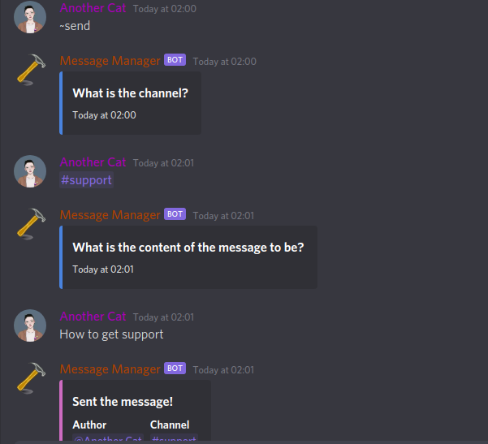
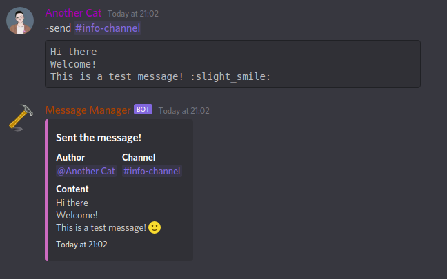
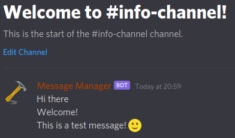
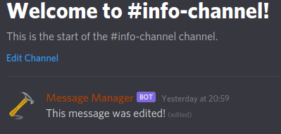
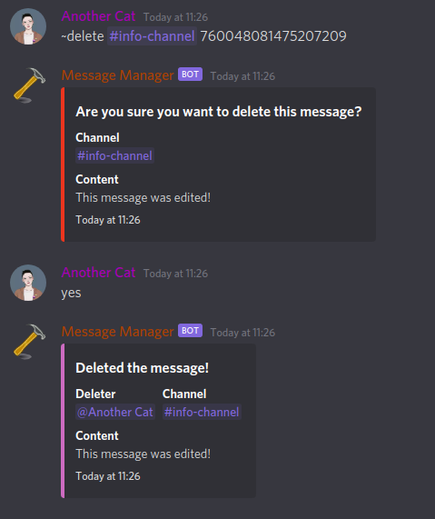

# Messages

## Features

* Sending messages remotely \(from another channel\)
* Editing messages that were 'sent' by someone else
* Deleting messages from the bot
* Fetching the bare message content
* Commands limited to users with a set role

## Usage

### Interactive modes

All message commands are interactive.  
This means that if parts of the command are not given, you will be prompted for them. An example of the `send` command and this being used is below:



### Sending messages

To send a message you must specify the channel and content to send.  
The content may be either just the exact message after the channel or enclosed in a code block with triple backticks \( \`\`\` \). If it is the code block will be removed before sending. If you would like to send a code block just put six backticks instead of three.


The `<channel>` can be either the channel id or the channel mention.


`~send <channel> <content>`

Example:






### Editing Messages

To edit messages you need to provide the channel, message id and the new content  
The bot cannot edit messages that were not sent from the bot.

`~edit <channel> <message id> <new content>`




### Fetching messages

When you 'fetch' a message it will return a `.txt` file.  
This is useful because it mean that you can view and change the exact content that the bot handles without any of discord's formatting.

`~fetch <channel> <message id>`



```text
Content:

This message was edited!
```



### Deleting messages

The bot can delete messages that it has sent. This is useful in situations where you don't have the `MANAGE MESSAGES` permission.  
You will be prompted to confirm the deletion  


A `.txt` file will be returned if the content is too long.


`~delete <channel> <message id>`


