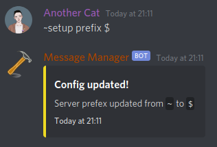
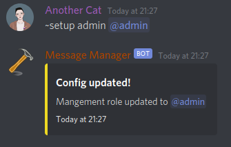

# Config

For the bot to function you are required to set server configuration  
For each config command if you leave out the field in `<>` it will output the current setting.

All config commands are locked to users with administration permissions

If you put `None` in the place of the setting it will either remove the setting or reset it to it's default value.

`~setup admin None`

## Prefix

The default prefix is `~`

To set a prefix do `~setup prefix <prefix>`  
The default prefix will no longer work in this server  
However mentioning the bot is always a prefix no matter what the set prefix.

## Management role

This role will allow access to message management commands. These are `~send`, `~edit`, `~delete` and `~fetch`.

Set role with `~setup admin <role>`  
`<role>` Can be either the role id or mentioning the role.

## Logging Channel

This channel is the channel where log messages will be sent to.  
It's suggested that this is a private channel

Set the channel with `~setup logging <channel>`
